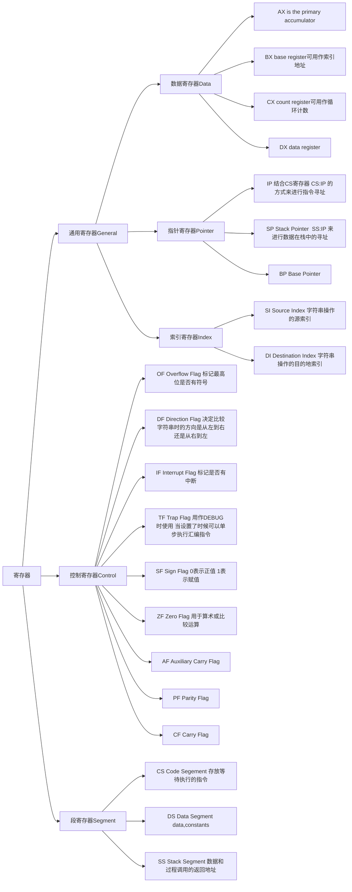

# Lab 1: Booting a PC

## Part1: PC Bootstrap

### Exercise1

**熟悉汇编指令**。可参考以下两个资源：

- [the 6.828 reference page](https://pdos.csail.mit.edu/6.828/2018/reference.html)
- the section "The Syntax" in [Brennan's Guide to Inline Assembly](http://www.delorie.com/djgpp/doc/brennan/brennan_att_inline_djgpp.html)

### Exercise2

**使用 GDB 的 si 指令（单步执行汇编指令）来跟踪只读的 BIOS 执行细节，猜一猜他都干了些什么。暂时不需要深入其中的细节，知道 BIOS 大体上干了些什么就行。**可以参考以下资料：

- [Phil Storrs I/O Ports Description](http://web.archive.org/web/20040404164813/members.iweb.net.au/~pstorr/pcbook/book2/book2.htm)
- [6.828 reference materials page](https://pdos.csail.mit.edu/6.828/2018/reference.html)

我们需要在 lab1 的目录下依次运行以下两个指令：

- `make qemu-nox-gdb` ，*注意在这个窗口中当 JOS 启动后，可以使用 `ctrl + a, z` 来退出*
- `make gdb`，在 gdb 的调试窗口使用 si 打印输出

```bash
The target architecture is assumed to be i8086
[f000:fff0]    0xffff0: ljmp   $0xf000,$0xe05b # BIOS 从 0xffff0 处开始执行第一条指令，这个地址离 BIOS top 地址只差了16字节，毕竟16字节存不了什么东西，所以首先跳转到 0xe05b
[f000:e05b]    0xfe05b: cmpl   $0x0,%cs:0x6ac8 # 判断 0xf6ac8 是否等于0（此处cs=0xf000）
[f000:e062]    0xfe062: jne    0xfd2e1 # 如果 0xf6ac8 处的值不为零则跳转到 0xfd2e1 执行（这里是不等的）
[f000:e066]    0xfe066: xor    %dx,%dx # 设置 dx=0（dx: data register)

[f000:e068]    0xfe068: mov    %dx,%ss # 设置 ss=0 (ss: stack segmen 栈段寄存器)
[f000:e06a]    0xfe06a: mov    $0x7000,%esp  # 设置 栈指针寄存器 0x7000 (SP: stack pointer)
[f000:e070]    0xfe070: mov    $0xf34c2,%edx # 设置 edx 寄存器值为 0xf34c2
[f000:e076]    0xfe076: jmp    0xfd15c   # 跳转到 0xfd15c
[f000:d15c]    0xfd15c: mov    %eax,%ecx # 设置 ecx 的值为 eax 的值
[f000:d15f]    0xfd15f: cli # 关闭中断指令 clear interrupt flag，设置 IF 标记位为0
[f000:d160]    0xfd160: cld # 设置方向位标记为0 clear direction flag

### 0x70 和 0x71 是为了控制 CMOS 端口，下面几个指令是用来关闭 NMI 中断(non-maskable interrupt)
[f000:d161]    0xfd161: mov    $0x8f,%eax # 设置 eax 为 0x8f
[f000:d167]    0xfd167: out    %al,$0x70  # 把 al 的值输出到端口 0x70 (al 为 eax 第八位，都为1)
[f000:d169]    0xfd169: in     $0x71,%al  # 把 0x71 端口的值输入到 al 寄存器

### 启动 A20 地址线(which is necessary to enter the protected mode)
[f000:d16b]    0xfd16b: in     $0x92,%al  # 把 0x92 端口的值输入到 al 寄存器
[f000:d16d]    0xfd16d: or     $0x2,%al
[f000:d16f]    0xfd16f: out    %al,$0x92

### 加载全局描述符表寄存器(GDTR global descriptor table regsiter)
[f000:d171]    0xfd171: lidtw  %cs:0x6ab8 # 从 0xf6ab8 加载中断描述符表 LIDT Load interrupt descriptor table
[f000:d177]    0xfd177: lgdtw  %cs:0x6a74 # 从 0xf6a74 加载全局描述符表 LGDT Load global descriptor table

### 设置 CRO 的最低位(Protection Enable) 为1，即：启用保护模式
[f000:d17d]    0xfd17d: mov    %cr0,%eax # CR0 是一个 32bit 的控制集群器，bit0 表示 Protection Enable 标记位
[f000:d180]    0xfd180: or     $0x1,%eax
[f000:d184]    0xfd184: mov    %eax,%cr0

### 0x8 and 0x10 are segment selectors, 
### which are basically the indices of entries in the GDT (see P197 of book x86 Assembly Language - from Real Mode to Protected Mode).
### More info can be found in the 11th chapter of book x86 Assembly Language - from Real Mode to Protected Mode.
[f000:d187]    0xfd187: ljmpl  $0x8,$0xfd18f
=> 0xfd18f:     mov    $0x10,%eax
=> 0xfd194:     mov    %eax,%ds
=> 0xfd196:     mov    %eax,%es
=> 0xfd198:     mov    %eax,%ss
=> 0xfd19a:     mov    %eax,%fs
=> 0xfd19c:     mov    %eax,%gs
```

我们看到 BIOS 大体上干的事情：关闭中断、加载全局中断描述符表、全局描述符表、启用保护模式。

## Part2: The Boot Loader

### Exercise3

**查看[lab tools guide](https://pdos.csail.mit.edu/6.828/2018/labguide.html) 了解 GDB 的用法。在 boot 扇区的入口处 0x7c00 处设置断点，使用 `x/i` 命令来反编译 boot loader 的指令，比较 boot loader 源码 `obj/boot/boot.asm` 和 GDB 中打印的指令区别。跟踪进 boot/main.c 的 bootmain() 函数，进入到 readsect()。确定 readsect() 中每条语句对应的汇编指令。调试完 readsec() 后回到 bootmain()，确定从磁盘中读取 kernel 扇区的 for 循环开始和结束地方。确定循环结束后需要执行的指令，并在那个地方设置断点。然后单步执行完 boot loader 后续的代码。**

**3.1 什么时候开始执行 32-bit 的代码？那条语句触发了 16bit 到 32bit 模式的转换？**

```bash
0x7c00:      cli # 禁用中断
0x7c01:      cld
0x7c02:      xor    %ax,%ax
0x7c04:      mov    %ax,%ds
0x7c06:      mov    %ax,%es
0x7c08:      mov    %ax,%ss

## 开启 A20 地址线
0x7c0a:      in     $0x64,%al
0x7c0c:      test   $0x2,%al
0x7c0e:      jne    0x7c0a
0x7c10:      mov    $0xd1,%al
0x7c12:      out    %al,$0x64
0x7c14:      in     $0x64,%al
0x7c16:      test   $0x2,%al
0x7c18:      jne    0x7c14
0x7c1a:      mov    $0xdf,%al
0x7c1c:      out    %al,$0x60

## 全局描述符表
0x7c1e:      lgdtw  0x7c64

## 保护模式
0x7c23:      mov    %cr0,%eax
0x7c26:      or     $0x1,%eax
0x7c2a:      mov    %eax,%cr0     # 模式转换

0x7c2d:      ljmp   $0x8,$0x7c32  # 开始执行 32bit 的代码
```

**3.2 Boot loader 执行的最后一条指令是什么，kernel 加载后执行的第一条指令是什么？**

```bash
# b *0x7d6b 观察 obj/boot/boot.asm 可得最后一句指令
0x7d6b:      call   *0x10018 # boot loader 最后一条语句

# si 单步执行后，得到 kernel 执行的第一条指令
0x10000c:    movw   $0x1234,0x472 # kernel 的第一条语句
```

**3.3 kernel 第一条指令地址是什么**

观察上面的输出，得到 **0x10000c**

**3.4 boot loader 怎么知道需要从磁盘中读取多少个扇区来加载完整的 kernel 呢？从哪可以获取这些信息？**

内核是 elf 文件格式，可以通过 elf header 中的信息知道需要读取多少扇区。

```bash
➜  readelf -h obj/kern/kernel
ELF Header:
  Magic:   7f 45 4c 46 01 01 01 00 00 00 00 00 00 00 00 00
  Class:                             ELF32
  Data:                              2's complement, little endian
  Version:                           1 (current)
  OS/ABI:                            UNIX - System V
  ABI Version:                       0
  Type:                              EXEC (Executable file)
  Machine:                           Intel 80386
  Version:                           0x1
  Entry point address:               0x10000c
  Start of program headers:          52 (bytes into file)
  Start of section headers:          86776 (bytes into file)
  Flags:                             0x0
  Size of this header:               52 (bytes)
  Size of program headers:           32 (bytes)
  Number of program headers:         3
  Size of section headers:           40 (bytes)
  Number of section headers:         15
  Section header string table index: 14
```

### Exercise4

**熟悉C语言指针。运行 [pointers.c](https://pdos.csail.mit.edu/6.828/2018/labs/lab1/pointers.c) ，搞清楚 1-6 行输出的含义，了解2-4行是怎么输出所有值的，了解第5行的输出为什么看起来怪怪的。**

```c
int a[4];
int *b = malloc(16);
int *c;
int i;

printf("1: a = %p, b = %p, c = %p\n", a, b, c);
// 1: a = 0x7fff024853f0, b = 0x55ac1d3f0260, c = 0xf0b5ff
// 多说一句，b 是 malloc 出来的，所以其地址比 a 要小，因为 a 是从栈中分配的（栈地址在高位）

c = a;
for (i = 0; i < 4; i++)
	a[i] = 100 + i;

c[0] = 200;
printf("2: a[0] = %d, a[1] = %d, a[2] = %d, a[3] = %d\n", a[0], a[1], a[2], a[3]);
// 2: a[0] = 200, a[1] = 101, a[2] = 102, a[3] = 103

c[1] = 300;
*(c + 2) = 301;
3[c] = 302; // 这个等同于 *(c+3)
printf("3: a[0] = %d, a[1] = %d, a[2] = %d, a[3] = %d\n", a[0], a[1], a[2], a[3]);
// 3: a[0] = 200, a[1] = 300, a[2] = 301, a[3] = 302

c = c + 1;
*c = 400;
printf("4: a[0] = %d, a[1] = %d, a[2] = %d, a[3] = %d\n", a[0], a[1], a[2], a[3]);
// 4: a[0] = 200, a[1] = 400, a[2] = 301, a[3] = 302

c = (int *) ((char *) c + 1);
*c = 500;
printf("5: a[0] = %d, a[1] = %d, a[2] = %d, a[3] = %d\n", a[0], a[1], a[2], a[3]);
// 5: a[0] = 200, a[1] = 128144, a[2] = 256, a[3] = 302

b = (int *) a + 1;
c = (int *) ((char *) a + 1);
printf("6: a = %p, b = %p, c = %p\n", a, b, c);
// 6: a = 0x7fff024853f0, b = 0x7fff024853f4, c = 0x7fff024853f1
```

其中需要对第5行的输出做一些说明。每个 int 占四个字节，32位。对于 a[1]=400=0x0190，a[2]=301=0x012d他们的分布为

```
a[1]        a[2]
90 01 00 00 2d 01 00 00
   ^
```

经过 `c = (int *) ((char ) c + 1);` 后，C 实际指向的是上图的 `^` 位置。**c=500=0x1f4，所以最新的内存分布为

```
a[1]        a[2]
90 f4 01 00 00 01 00 00
   ^
```

a[1]=0x1f490=128144, a[2]=0x0100=256

### Exercise5

**重新跟踪 boot loader 程序，观察当我们给出错误的 link address 后，第一条出错的指令。我们可以通过修改 `boot/Makefrag` 来修改 link address。每次修改完后，使用 make clean，再执行 make 来重新编译。练习结束后，记得再把正确的地址改回来。**

修改 *boot/Makefrag* 第20行 `$(V)$(LD) $(LDFLAGS) -N -e start -Ttext **0x7D00** -o $@.out $^`

```bash
[f000:fff0]    0xffff0: ljmp   $0xf000,$0xe05b
0x0000fff0 in ?? ()
+ symbol-file obj/kern/kernel
(gdb) b *0x7c00
Breakpoint 1 at 0x7c00
(gdb) c
Continuing.
[   0:7c00] => 0x7c00:  cli ### 关闭中断
(gdb) si
[   0:7c01] => 0x7c01:  cld
[   0:7c02] => 0x7c02:  xor    %ax,%ax
[   0:7c04] => 0x7c04:  mov    %ax,%ds
[   0:7c06] => 0x7c06:  mov    %ax,%es
[   0:7c08] => 0x7c08:  mov    %ax,%ss

### A20 地址线
[   0:7c0a] => 0x7c0a:  in     $0x64,%al
[   0:7c0c] => 0x7c0c:  test   $0x2,%al
[   0:7c0e] => 0x7c0e:  jne    0x7c0a
[   0:7c10] => 0x7c10:  mov    $0xd1,%al
[   0:7c12] => 0x7c12:  out    %al,$0x64
[   0:7c14] => 0x7c14:  in     $0x64,%al
[   0:7c16] => 0x7c16:  test   $0x2,%al
[   0:7c18] => 0x7c18:  jne    0x7c14
[   0:7c1a] => 0x7c1a:  mov    $0xdf,%al
[   0:7c1c] => 0x7c1c:  out    %al,$0x60

### 全局符号描述符表
[   0:7c1e] => 0x7c1e:  lgdtw  0x7d64

### 进入保护模式
[   0:7c23] => 0x7c23:  mov    %cr0,%eax
[   0:7c26] => 0x7c26:  or     $0x1,%eax
[   0:7c2a] => 0x7c2a:  mov    %eax,%cr0

### 下面的就卡住了，通过 c 进行运行，得到错误信息
[   0:7c2d] => 0x7c2d:  ljmp   $0x8,$0x7d32
[   0:7c2d] => 0x7c2d:  ljmp   $0x8,$0x7d32
[   0:7c2d] => 0x7c2d:  ljmp   $0x8,$0x7d32
0x00007c2d in ?? ()
(gdb) c
Continuing.

Program received signal SIGTRAP, Trace/breakpoint trap.
[   0:7c2d] => 0x7c2d:  ljmp   $0x8,$0x7d32
```

我们看 `0x7c2d:  ljmp   $0x8,$0x7d32` 不能正常执行。到在调试完了，记得修改回来。

### Exercise6

**我们可以使用 GDB 的 x 指令来查看内存内容。重置机器，在 BIOS 刚进入 boot loader 时查看 0x00100000 处的内容，当 bootloader 进入内核（kernel）时再检查改地址的内容。看看他们有什么不同？在第二个断点处，内容是什么？（其实不借助 QEMU，你思考下，也能回答这个问题）**

根据之前的联系，我们知道了条件中所需要的两个断点的地址

- BIOS 刚进入 boot loader:  0x7c00
- Boot loader 刚进入 kernel: 0x10000c

```bash
The target architecture is assumed to be i8086
[f000:fff0]    0xffff0: ljmp   $0xf000,$0xe05b
0x0000fff0 in ?? ()
+ symbol-file obj/kern/kernel

### 打断点
(gdb) b *0x7c00   # 刚进入 bootloader
Breakpoint 1 at 0x7c00
(gdb) b *0x10000c # 刚进入 kernel
Breakpoint 2 at 0x10000c

### 执行
(gdb) c
Continuing.
[   0:7c00] => 0x7c00:  cli

### 刚进入 boot loader 的内容
Breakpoint 1, 0x00007c00 in ?? ()
(gdb) x/8x 0x00100000
0x100000:       0x00000000      0x00000000      0x00000000      0x00000000
0x100010:       0x00000000      0x00000000      0x00000000      0x00000000
(gdb) c
Continuing.
The target architecture is assumed to be i386
=> 0x10000c:    movw   $0x1234,0x472

### 刚进入 kernel 时的内容
Breakpoint 2, 0x0010000c in ?? ()
(gdb) x/8x 0x00100000
0x100000:       0x1badb002      0x00000000      0xe4524ffe      0x7205c766
0x100010:       0x34000004      0x2000b812      0x220f0011      0xc0200fd8
```

## Part3: The Kernel

### Exercise7

**在进入 JOS kernel 执行 movl %eax, %cr0 前打个断点，查看内存 0x00100000 和 0xf0100000 的值。然后使用 stepi 指令执行后，再次检查 0x00100000 和 0xf0100000  处内存的值，确保明白发生了什么。**

```bash
The target architecture is assumed to be i8086
[f000:fff0]    0xffff0: ljmp   $0xf000,$0xe05b
0x0000fff0 in ?? ()
+ symbol-file obj/kern/kernel

### 在 kernel 入口处打断点
(gdb) b *0x10000c
Breakpoint 1 at 0x10000c

### 运行到断点处
(gdb) c
Continuing.
The target architecture is assumed to be i386
=> 0x10000c:    movw   $0x1234,0x472

### 检查指令，看看需要在哪里打断点
(gdb) x/i
   0x100015:    mov    $0x112000,%eax
(gdb)
   0x10001a:    mov    %eax,%cr3
(gdb)
   0x10001d:    mov    %cr0,%eax
(gdb)
   0x100020:    or     $0x80010001,%eax
(gdb)
   0x100025:    mov    %eax,%cr0  #### 这里
(gdb)
   0x100028:    mov    $0xf010002f,%eax
(gdb)
   0x10002d:    jmp    *%eax

### 打断点
(gdb) b *0x100025
Breakpoint 2 at 0x100025

### 执行
(gdb) c
Continuing.
=> 0x100025:    mov    %eax,%cr0

Breakpoint 2, 0x00100025 in ?? ()

### 检查内存
(gdb) x/8x 0x100000
0x100000:       0x1badb002      0x00000000      0xe4524ffe      0x7205c766
0x100010:       0x34000004      0x2000b812      0x220f0011      0xc0200fd8
(gdb) x/8x 0xf0100000
0xf0100000 <_start+4026531828>: 0x00000000      0x00000000      0x00000000      0x00000000
0xf0100010 <entry+4>:   0x00000000      0x00000000      0x00000000      0x00000000

(gdb) si
=> 0x100028:    mov    $0xf010002f,%eax
0x00100028 in ?? ()
### 执行完之后再次检查内存内容，发现 0xf010000 和 0x100000 的内容是一致的
(gdb) x/8x 0xf0100000
0xf0100000 <_start+4026531828>: 0x1badb002      0x00000000      0xe4524ffe      0x7205c766
0xf0100010 <entry+4>:   0x34000004      0x2000b812      0x220f0011      0xc0200fd8
(gdb)
```

通过检查执行 `mov    %eax,%cr0` 前后的内存内容，我们发现，在虚拟内存映射后，两者的内存内容是一致的。

**如果说 mapping 不正确，那么第一条失败的指令是什么？通过在 kernel/entry.S 中注释 movl %eax, %cr0，来进行跟踪，看看你的理解对不对。**

```bash
(gdb) b *0x10000c
Breakpoint 1 at 0x10000c
(gdb) c
Continuing.
The target architecture is assumed to be i386
=> 0x10000c:    movw   $0x1234,0x472

Breakpoint 1, 0x0010000c in ?? ()
(gdb) b *0x100025
Breakpoint 2 at 0x100025
(gdb) c
Continuing.
=> 0x100025:    mov    $0xf010002c,%eax

Breakpoint 2, 0x00100025 in ?? ()
(gdb) si
=> 0x10002a:    jmp    *%eax #### 不开启内存寻址，找不到 0xf010002c
0x0010002a in ?? ()
(gdb)
=> 0xf010002c <relocated>:      add    %al,(%eax)
relocated () at kern/entry.S:74
74              movl    $0x0,%ebp                       # nuke frame pointer
(gdb)
```

不开启内存寻址，那么引用内存地址的地方就会出错。

### Exercise8

**找到并完善来使用 `%o` 格式的八进制格式化输出。**

在 `lib/printfmt.c` 中 Line 207：

```c
// (unsigned) octal
		case 'o':
			// Replace this with your code.
			num = getuint(&ap, lflag);
			base = 8;
			goto number;
```

**8.1 解释 printf.c 和 console.c 之间的接口，尤其是 console.c 导出了哪些函数，这些函数又是怎么被 printf.c 是用的。**

printf.c 会调用 console.c 提供的函数，并且console.c 导出的函数如下

```c
// `High'-level console I/O.  Used by readline and cprintf.

void cputchar(int c)
{
	cons_putc(c);
}

int getchar(void)
{
	int c;

	while ((c = cons_getc()) == 0)
		/* do nothing */;
	return c;
}

int iscons(int fdnum)
{
	// used by readline
	return 1;
}
```

在 printf.c 中，使用步骤如下

1. `cprintf` 函数中调用了 `vcprintf` 函数
2. 在 `vcprintf` 函数中调用 `vprintfmt` 时，传递了 `putch` 函数指针
    1. 在 `putch` 函数中，调用了 console.c 的 `cputchar` 函数

**8.2 解释 console.c 中的下述代码**

```c
// What is the purpose of this?
if (crt_pos >= CRT_SIZE) { // 当前游标的位置到控制台底部了（也就是说控制台被填满了）
	int i;

	memmove(crt_buf, crt_buf + CRT_COLS, (CRT_SIZE - CRT_COLS) * sizeof(uint16_t)); // 滚动屏幕，覆盖第一行内容
	for (i = CRT_SIZE - CRT_COLS; i < CRT_SIZE; i++) // 将最后一行的内容设置为空字符和黑色背景
		crt_buf[i] = 0x0700 | ' '; // 让空格颜色为黑色
	crt_pos -= CRT_COLS; // 光标移动到行首
}
```

cor_pos是当前屏幕当前光标位置,CRT_SIZE是当前屏幕大小,CRT_COLS是当前屏幕宽度.

这段代码的作用是,将屏幕上移一行,然后最后一行用黑色空格填充(比如一个文本编辑器写满了,然后按回车,进入下一行)

**8.3 跟踪下面的代码，解答问题。**

```c
int x = 1, y = 3, z = 4;
cprintf("x %d, y %x, z %d\n", x, y, z);
```

- **`cprintf()` 调用中，`fmt` 和 `ap` 分别指向什么？**
    
    函数定义如下，其中 `fmt` 指向的是 `"x %d, y %x, z %d\n"`，`ap` 指向的是参数 `x, y, z`
    
    ```c
    int cprintf(const char *fmt, ...)
    {
    	va_list ap;
    	int cnt;
    
    	va_start(ap, fmt);
    	cnt = vcprintf(fmt, ap);
    	va_end(ap);
    
    	return cnt;
    }
    ```
    
- **按顺序列出调用的细节**
    - `**const_putc` 列出调用的指令和它的参数**
    - `**va_arg` 列出调用后 ap 的指向**
    - `**vcprintf` 列出它的两个参数的值**
    
    ```c
    vcprintf (fmt=0xf0101a77 "x %d, y %x, z %d\n", ap=0xf010ffd4)
    cons_putc (c=120 'x')
    cons_putc (c=32 ' ')
    ap=0xf010ffd4 -> 1
    va_arg (*ap, int) // 获取可变参数的当前参数，返回指定类型并将指针指向下一参数
    ap=0xf010ffd8 -> 3
    cons_putc (c=49 '1')
    cons_putc (c=44 ',')
    cons_putc (c=32 ' ')
    cons_putc (c=121 'y')
    cons_putc (c=32 ' ')
    ap=0xf010ffd8 -> 3
    va_arg ((*ap, int)
    ap=0xf010ffdc -> 4
    cons_putc (c=51 '3')
    cons_putc (c=44 ',')
    cons_putc (c=32 ' ')
    cons_putc (c=122 'z')
    cons_putc (c=32 ' ')
    ap=0xf010ffdc -> 4
    va_arg (*ap, int)
    ap=0xf010ffe0 -> 0xf0113060
    cons_putc (c=52 '4')
    cons_putc (c=10 '\n')
    ```
    

**8.4 运行下面的代码，输出是什么？**

```c
unsigned int i = 0x00646c72;
cprintf("H%x Wo%s", 57616, &i);
```

输出结果是 `He110 World`

- 57616 的16进制为 0xell0，所以经过了 `H%x` 的格式化后就成了 `Hell0`
- 0x00646c72在小端序机器上排列为 72 6c 64 00，对应的 ascii 为 `rld\0`

如果在大端序机器上，i 的值改为 0x726c6400 即可。

**8.5 下面的代码，y= 后面输出什么（这个输出不是一个特定的值）？为什么会这样？**

```c
cprintf("x=%d y=%d", 3);
```

输出为 `x=3 y=1600`,

根据 gdb 调试 cprintf 栈中信息可以看出，0x00000003 的后面是 0x00000640，转成 10 进制刚好是 1600，也就是说 y=%d 的输出是在 3 之前进栈的参数，所以可能会输出任意的数。


**8.6 如果说 GCC 修改了他的调用参数压栈顺序为声明的顺序（即随后声明的最后压栈），那么 cprintf 需要怎样修改来适配这样的改动。**

需要修改 va_start, va_arg 和 va_end 的实现，`cprintf` 本身不需要修改。

### Exercise9

**确认内核是否初始化了他的 stack，并且确定 stack 在内存的什么位置。内核是怎么为他的 stack 保留空间的，并且栈指针初始化后指向保留空间的结尾，指向了哪里？**

kernel/entry.S 中进行了初始化

```wasm
# Clear the frame pointer register (EBP)
	# so that once we get into debugging C code,
	# stack backtraces will be terminated properly.
	movl	$0x0,%ebp			# nuke frame pointer

	# Set the stack pointer
	movl	$(bootstacktop),%esp
```

在反汇编文件 obj/kernel/kernel.asm 中找到对应的值为 0xf0110000

```wasm
# Set the stack pointer
	movl	$(bootstacktop),%esp
f0100034:	bc 00 00 11 f0       	mov    $0xf0110000,%esp
```

在 entry.S 中可以看到栈的大小

```wasm
###################################################################
# boot stack
###################################################################
	.p2align	PGSHIFT		# force page alignment
	.globl		bootstack
bootstack:
	.space		KSTKSIZE
	.globl		bootstacktop   
bootstacktop:
```

其中 KSTKSIZE 在 memlayout.h 中定义 `#define KSTKSIZE	(8*PGSIZE)	// size of a kernel stack`

一个 PAGESIZE=4K，所以其大小是 32K。我们知道了栈初始化为 $0xf0110000，而栈向低方向增长，所以其地址范围是：0xf0110000 → 0x0108000

### Exercise10

**熟悉x86下的C语言调用约定，在 obj/kern/kernel.asm 中找到 test_backtrace 的地址，并在此设置断点，看看内核启动后的 test_backtrace 被调用发生了什么。每一次递归调用 test_backtrace 时有多少个 32位字进栈，这些字是什么。**

```bash
### 函数打断点
(gdb) b *test_backtrace
Breakpoint 1 at 0xf0100040: file kern/init.c, line 13.

(gdb) c
Continuing.
The target architecture is assumed to be i386
=> 0xf0100040 <test_backtrace>: push   %ebp

Breakpoint 1, test_backtrace (x=5) at kern/init.c:13
13      {

### 第一次到断点，寄存器
(gdb) info registers esp
esp            0xf010ffdc       0xf010ffdc
(gdb) c
Continuing.
=> 0xf0100040 <test_backtrace>: push   %ebp

Breakpoint 1, test_backtrace (x=4) at kern/init.c:13
13      {

### 第二次
(gdb) info registers esp
esp            0xf010ffbc       0xf010ffbc
(gdb) c
Continuing.
=> 0xf0100040 <test_backtrace>: push   %ebp

Breakpoint 1, test_backtrace (x=3) at kern/init.c:13
13      {

### 第三次
(gdb) info registers esp
esp            0xf010ff9c       0xf010ff9c

### 查看内容
(gdb) x/20x $esp
0xf010ff9c:     **0xf01000a1**      0x00000003      0x00000004      0xf010ffc8 # 第三次
0xf010ffac:     0xf010004a      0xf0111308      0x00000005      **0xf010ffd8**
0xf010ffbc:     **0xf01000a1**      0x00000004      0x00000005      0xf010fff8 # 第二次
0xf010ffcc:     0xf010004a      0xf0111308      0x00010094      **0xf010fff8**
0xf010ffdc:     **0xf0100104**      0x00000005      0x00001aac      0x00000640 # 第一次
0xf010ffec:     0x00000000      0x00000000      0x00010094      0x00000000

```

8 个 32bit

### Exercise11

**实现 backtrace 方法，按要求格式进行信息输出（写完后，通过 make grade 来进行验证）。**

输出要求的格式如下

```bash
Stack backtrace:
  ebp f0109e58  eip f0100a62  args 00000001 f0109e80 f0109e98 f0100ed2 00000031
  ebp f0109ed8  eip f01000d6  args 00000000 00000000 f0100058 f0109f28 00000061
  ...
```

其中根据材料描述 esp 是一种硬件设计，但是 ebp 是一种软件的调用约定。当函数进行调用时，会保存上一个函数的 esp 至 ebp，这样通过 ebp 就可以溯源整个链。refer to [C Function Call Conventions and the Stack](https://www.csee.umbc.edu/~chang/cs313.s02/stack.shtml).

### Exercise12

**整体的目标是修改 stack backtrace 使其每个的 eip 输出支持：函数名、源文件和行号信息。**

```bash
K> backtrace
Stack backtrace:
  ebp f010ff78  eip f01008ae  args 00000001 f010ff8c 00000000 f0110580 00000000
         kern/monitor.c:143: monitor+106
  ebp f010ffd8  eip f0100193  args 00000000 00001aac 00000660 00000000 00000000
         kern/init.c:49: i386_init+59
  ebp f010fff8  eip f010003d  args 00000000 00000000 0000ffff 10cf9a00 0000ffff
         kern/entry.S:70: <unknown>+0
```

**12.1 完善 debuginfo_eip 函数，通过调用 stab_binsearch 来找到某个地址对应的行号。完善 mon_backtrace 来进一步格式化输出**

```c
// Search within [lline, rline] for the line number stab.
	// If found, set info->eip_line to the right line number.
	// If not found, return -1.
	//
	// Hint:
	//	There's a particular stabs type used for line numbers.
	//	Look at the STABS documentation and <inc/stab.h> to find
	//	which one.
	// Your code here.
	stab_binsearch(stabs, &lline, &rline, N_SLINE, addr);
	if (lline <= rline)
		info->eip_line = stabs[lline].n_desc;
	else
		return -1;
```

```c
int
mon_backtrace(int argc, char **argv, struct Trapframe *tf)
{
    uint32_t ebp = read_ebp();
    struct Eipdebuginfo info; //////
    cprintf("Stack backtraces:\n");
    /* ebp's initial value is set to 0 in kern/entry.S */
    while (ebp != 0) {
        /* eip and arguments' addresses can be inferred from ebp */
        cprintf("  ebp %08x  eip %08x  args %08x %08x %08x %08x %08x\n", 
                ebp, *(uint32_t *)(ebp + 4), *(uint32_t *)(ebp + 8), *(uint32_t *)(ebp + 12),
                *(uint32_t *)(ebp + 16), *(uint32_t *)(ebp + 20), *(uint32_t *)(ebp + 24));
        /* look up eip in the symbol table and obtain more debugging info */
        if (debuginfo_eip(*(uint32_t *)(ebp + 4), &info) == 0) { /////
            cprintf("         %s:%d: %.*s+%d\n",
                    info.eip_file, info.eip_line, info.eip_fn_namelen, info.eip_fn_name,
                    *(uint32_t *)(ebp + 4) - info.eip_fn_addr);
        }
        /* obtain caller's ebp  */
        ebp = *(uint32_t *)ebp;
    }
    return 0;
}
```

**12.2 添加一个 backtrace 的指令**

```c
// monitor.c
static struct Command commands[] = {
	{ "help", "Display this list of commands", mon_help },
	{ "kerninfo", "Display information about the kernel", mon_kerninfo },
	{ "backtrace", "Display stack backtrace", mon_backtrace },
};
```

---

# 附录

## 实验准备

- 实验说明
    
    [Lab 1: PC Bootstrap and GCC Calling Conventions](https://pdos.csail.mit.edu/6.828/2018/labs/lab1/)
    
- 工具链安装，其中我是在 Ubuntu 18.04 上使用，重点在于 quem 的安装，需要使用 mit 改过的版本
    
    [6.828 / Fall 2018](https://pdos.csail.mit.edu/6.828/2018/tools.html)
    
    ```bash
    # git clone https://github.com/mit-pdos/6.828-qemu.git qemu
    ./configure --disable-kvm --disable-werror # [--prefix="/usr/local"] [--target-list="i386-softmmu x86_64-softmmu"]
    make && make install
    ```
    

## 实验说明部分内容摘要

### 内存分布

- 内存分布，注意低地址中有为 BIOS 保留的区域。高地址有虚拟内存映射的区域

```
+------------------+  <- 0xFFFFFFFF (4GB)
|      32-bit      |
|  memory mapped   |
|     devices      |
|                  |
/\/\/\/\/\/\/\/\/\/\

/\/\/\/\/\/\/\/\/\/\
|                  |
|      Unused      |
|                  |
+------------------+  <- depends on amount of RAM
|                  |
|                  |
| Extended Memory  |
|                  |
|                  |
+------------------+  <- 0x00100000 (1MB)
|     BIOS ROM     |
+------------------+  <- 0x000F0000 (960KB)
|  16-bit devices, |
|  expansion ROMs  |
+------------------+  <- 0x000C0000 (768KB)
|   VGA Display    |
+------------------+  <- 0x000A0000 (640KB)
|                  |
|    Low Memory    |
|                  |
+------------------+  <- 0x00000000

```

### BIOS

BIOS 是直接硬件焊道主板上的，其地址区域也是约定俗成固定的，这样一上电就可以获取控制权。其开始的地址是上面内存分布中为 BIOS 预留的最顶端区域 `0x000ffff0`。

在外面使用 GDB 调试的时候可以计算出来：

```
[f000:fff0] 0xffff0:	ljmp   $0xf000,$0xe05b

16 * 0xf000 + fff0
= 0xf0000 + fff0
= 0xffff0
```

我们知道，BIOS的地址段顶部为 `0x100000`，这里运算后的地址正好是 BIOS 结束地址的前 16 字节处。所以我们看到第一条指令就是从这个地址跳转（`ljmp   $0xf000,$0xe05b`）至  BIOS 前面的某个地址。

启动过程大体做了以下事情：

- 设置全局的中断描述符表
- 初始化部分硬件设备，如VGA
- 从现有的硬件（如磁盘或光驱）中查找 boot loader，并且移交控制权。

### Boot loader

当 BIOS 找到了 boot loader 后会移交控制权，他会从物理地址的 **0x7c00** through 0x7dff 中加载 boot 扇区。

### Kernel

boot loader 会加载 kernel，并运行

## 关于 ELF（Executable and Linkable Format）

部分运维指令

- `objdump -h` 查看 header 信息
- `objdump -x` 查看更多信息
- `objdump -f` 查看 entry point
- 读取 elf header
    
    ```bash
    ➜  readelf -h obj/kern/kernel
    ELF Header:
      Magic:   7f 45 4c 46 01 01 01 00 00 00 00 00 00 00 00 00
      Class:                             ELF32
      Data:                              2's complement, little endian
      Version:                           1 (current)
      OS/ABI:                            UNIX - System V
      ABI Version:                       0
      Type:                              EXEC (Executable file)
      Machine:                           Intel 80386
      Version:                           0x1
      Entry point address:               0x10000c
      Start of program headers:          52 (bytes into file)
      Start of section headers:          86776 (bytes into file)
      Flags:                             0x0
      Size of this header:               52 (bytes)
      Size of program headers:           32 (bytes)
      Number of program headers:         3
      Size of section headers:           40 (bytes)
      Number of section headers:         15
      Section header string table index: 14
    ```
    

## 关于 real mode 和 protected mode

### real mode

8086处理器只支持 real mode，此模式下程序可以访问任意的内存或设备。这种模式不适合安全的多任务处理系统。

### protected mode

该模式被很多现代操作系统所使用，比如虚拟内存和内存保护。使用该模式有以下优势

1. It is easier to program in protected mode than in the 8086 real mode that other books use.
2. All modern PC operating systems run in protected mode.
3. There is free software available that runs in this mode.

## 参考资料

[ELF 定义](https://pdos.csail.mit.edu/6.828/2018/readings/elf.pdf)


[C指针](https://pdos.csail.mit.edu/6.828/2018/readings/pointers.pdf)


[Memory (Debugging with GDB)](https://sourceware.org/gdb/current/onlinedocs/gdb/Memory.html)

## 网友的一些解答

[MIT 6.828 Lab1 - Booting a PC (PC Bootstrap & Bootloader)](https://yangbolong.github.io/2017/02/12/lab1/)

[6.828 lab1 Booting a PC](https://rainjoe.github.io/post/lab1_-booting-a-pc/)

[MIT6.828-lab1](https://zhuanlan.zhihu.com/p/426788020)

## 关于 CS 和 IP

CS：段寄存器里面的代码段Code Segment

IP：就是指令指针(offset pointer)Instruction Pointer

IP和CS寄存器一起使用（形式 CS:IP），通过这样的方式能够确认下一条需要执行的完整指令地址。其计算的形式为

$address = 16 \times CS + IP$


## 关于寄存器 DX

[Assembly - Registers](https://www.tutorialspoint.com/assembly_programming/assembly_registers.htm)


